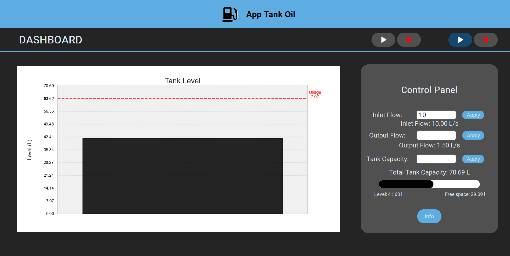
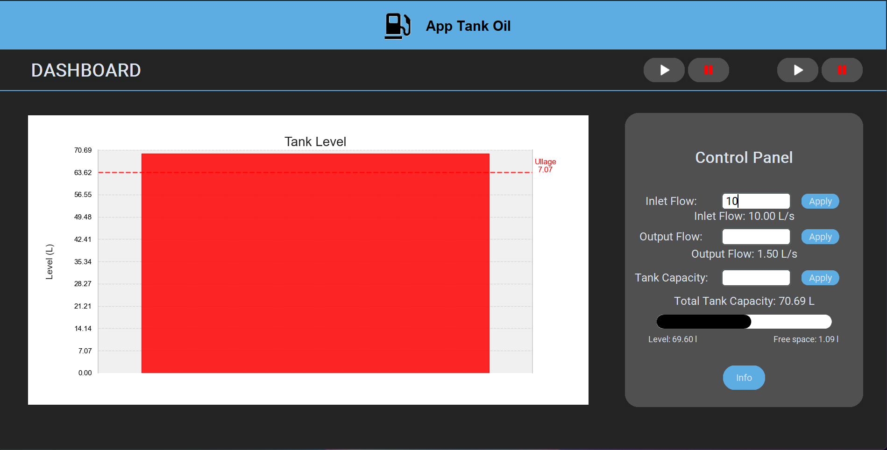

# App Tank Oil 


## Overview
App Tank Oil is a graphical user interface (GUI) application for managing and monitoring oil tank levels. The application allows users to log in, view tank levels, and control inlet and outlet flows.

## Features
- User login and authentication
- Dashboard to monitor tank levels
- Control panel to adjust inlet and outlet flows
- Graphical representation of tank levels
- Create new user accounts

## Installation
1. Clone the repository:
    ```sh
    git clone https://github.com/yourusername/App_tank_Oil.git
    ```
2. Navigate to the project directory:
    ```sh
    cd App_tank_Oil
    ```
3. Install the required dependencies:
    ```sh
    pip install -r requirements.txt
    ```

## Usage
1. Run the main application:
    ```sh
    python main.py
    ```
2. Log in using your credentials. If you don't have an account, create a new one using the "Create a new account" button or use "admin" as email and name.

3. Use the dashboard to monitor and control the tank levels.

## Project Structure
- `main.py`: Entry point of the application.
- `windows/login/form_login_desing.py`: Login window design and logic.
- `windows/gui/design_gui.py`: Main GUI design and logic.
- `generate/generate.py`: Logic for managing tank levels and flows.
- `generate/tank.py`: Tank class for managing tank properties.
- `generate/gasoline.py`: Gasoline class for managing inlet and outlet flows.
- `cache/persistence/repository/auth_user_repository.py`: Repository for user authentication.
- `cache/persistence/model.py`: Database models.

## Dependencies
- customtkinter
- PIL (Pillow)
- matplotlib
- seaborn
- numpy
- sqlalchemy

## Screenshots

### Tank Monitoring Dashboard


### Full Tank Alert


## Contributing
Contributions are welcome! Please open an issue or submit a pull request for any improvements or bug fixes.

## License
This project is licensed under the MIT License. See the [LICENSE](LICENSE) file for details.
